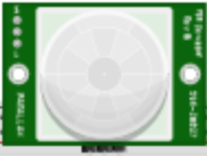
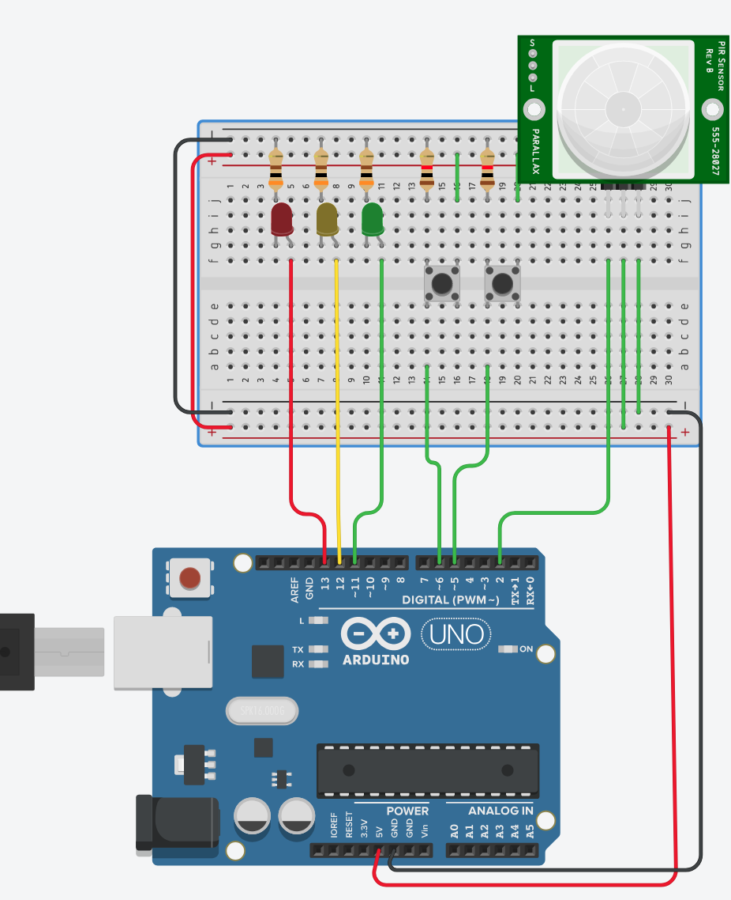

### Week 1: IoT device programming - hands-on assignment

#### Access control device

The hands-on is to be solved using the TinkerCAD: https://www.tinkercad.com/ simulator. Start by creating an account if you do not already have one. If you have an Arduino board yourself, then you may also build the actual physical prototype.

Start the assignment by drawing a [finite state machine](https://en.wikipedia.org/wiki/Finite-state_machine) that shows the states of the system, and the transition that may take place causing the system to change its state. The description of the behaviour of the system is provided below.

For approvement of the assignment you will have to either show the working solution to one of the lecturers (Lars or Tosin) - or hand-in a link to your TinkerCAD design on Canvas.

##### Resources

- Arduino language reference https://www.arduino.cc/reference/en
- Arduino board layout https://www.arduino.cc/en/Reference/Board   
- Short demovideo of the input/output example from the lectures https://www.youtube.com/watch?v=1kW8clGpUJQ
- Code from the input/output example presented at the lectures https://github.com/lmkr/dat159/blob/master/iotdevices/arduino/lecture1/InputOutput/InputOutput.ino
- TinkerCAD design for the input/output example presented at the lectures https://www.tinkercad.com/embed/ki35AdXHyJz?editbtn=1

##### Sensor and actuators

You will be using the following sensors with digital input

- A passive infrared-sensor (PIR) for detecting the approach of a person (motion)

- Two pushbuttons for entering an entry code - the order is the code.

You will be using the following actuators with digital output

- Three LEDs (red,yellow,green) for signalling state

##### Functional requirements

- The red LED is on when the system is in a LOCKED state. Initially, the system is locked.

- When motion is detected, the yellow LED will be on; and the system is WAITING for:

   - The user to do two pushes on the buttons. After each push, the yellow LED should blink shortly.

   - If the order it correct, then system will become UNLOCKED, and the green LED is on.

   - If the order it not correct, the red LED should blink and the system will go back to a LOCKED state

After a certain amount of time in the UNLOCKED state, the system should automatically enter the LOCKED state.

**Extra:** if the user has not pushed two buttons within a certain amount of time in the WAITING state, then system should go to the LOCKED state.

## My solution

In my solution I used a breadboard to keep things better organized.
I also made it such that the user has to move slightly while entering the passphrase.  
After the passphrase is correctly entered, the user can press either of the buttons to get the system back to a LOCKED state.

